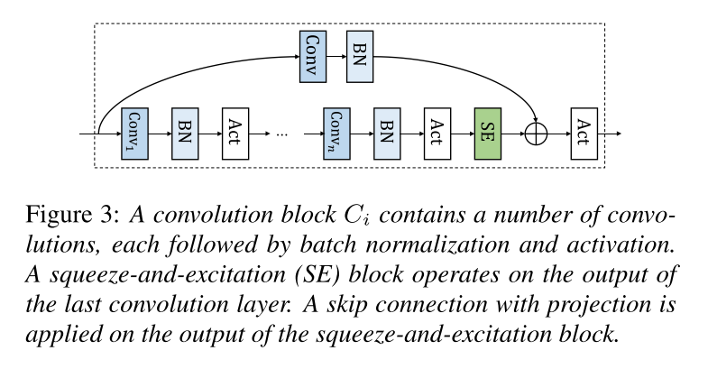

# ContextNet: Improving Convolutional Neural Networks for Automatic Speech Recognition with Global Context

Reference: [http://arxiv.org/abs/2005.03191](http://arxiv.org/abs/2005.03191)

## Example Model YAML Config

Go to [config.yml](./config.yml)

## Usage

Training, see `python examples/contextnet/train_*.py --help`

Testing, see `python examples/contextnet/test_*.py --help`

TFLite Conversion, see `python examples/contextnet/tflite_*.py --help`

## RNN Transducer Subwords - Results on LibriSpeech

**Summary**

- Number of subwords: 1008
- Maximum length of a subword: 10
- Subwords corpus: all training sets
- Number of parameters: 12,075,320
- Number of epochs: 86
- Train on: 8 Google Colab TPUs
- Train hours: 8.375 days uncontinuous (each day I trained 12 epoch because colab only allows 12 hours/day and 1 epoch required 1 hour) => 86 hours continuous (3.58333333 days)

**Pretrained and Config**, go to [drive](https://drive.google.com/drive/folders/1fzOkwKaOcMUMD9BAjcLLmSG2Tfpeabbq?usp=sharing)

**Epoch Transducer Loss**

**Epoch Learning Rate**

**Error Rates**

| **Test-clean** | Test batch size | Epoch |      WER (%)       |      CER (%)       |
| :------------: | :-------------: | :---: | :----------------: | :----------------: |
|    _Greedy_    |        1        |  86   | 10.356436669826508 | 5.8370333164930344 |